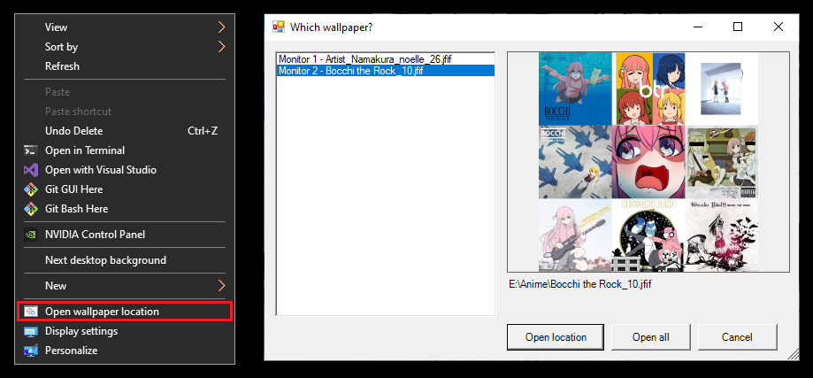

# Open Slideshow Wallpaper Path



Adds an **Open wallpaper location** item to the desktop right-click menu. 

It opens the location of the image currently displayed as your wallpaper. 

This is useful when a slideshow shows an image that you want to find, rename, or delete.

It adapts to your setup on its own:

- **Case 1: One wallpaper in one monitor** -> Explorer opens immediately, no dialog.
- **Case 2: Different wallpaper per monitor** -> a picker appears listing each one by filename, with a preview. Choose one, or click **Open all**.

Plugging in or unplugging a monitor needs **no** editing or reinstall.

## Contents

| File | Role |
| --- | --- |
| `OpenSlideshowWallpaperPath.ps1` | The actual program. **Don't delete or move to a different location.** |
| `Launch.vbs` | What the registry points at. Starts the script with no console window, finding it in its own folder. **Don't delete or move to a different location.** |
| `Install.ps1` | The installer. Builds the menu entry. |
| `README.md` | This file. |

## Install
1. Create the path `C:\Scripts\OpenSlideshowWallpaperPath\` and paste the files in there.
The folder structure should look like this:
```
C:\
└── Scripts/
    └── OpenSlideshowWallpaperPath/
        ├── OpenSlideshowWallpaperPath.ps1
        ├── Launch.vbs
        ├── Install.ps1
        └── README.md
```
2. Right-click `Install.ps1` -> **Run with PowerShell**.

And you are done installing.

No admin rights, restart, or sign-out required. 

Right-click the desktop and the entry appears at the bottom of the menu.

On Windows 11 it lives under **Show more options**, or hold Shift while right-clicking to jump straight there. The compact Windows 11 menu only accepts entries from packaged apps, so a plain script can't appear there.

If PowerShell blocks the script, run it as:

```powershell
powershell -ExecutionPolicy Bypass -File C:\Scripts\OpenSlideshowWallpaperPath\Install.ps1
```

## Uninstall

```powershell
powershell -ExecutionPolicy Bypass -File C:\Scripts\OpenSlideshowWallpaperPath\Install.ps1 -Remove
```

Running the command above will delete the registry key. 

After that delete the folder `C:\Scripts\OpenSlideshowWallpaperPath\`

## How it works

Windows caches the path of the current wallpaper in the registry under `HKCU\Control Panel\Desktop`, in binary values named `TranscodedImageCache_000`, `_001`, and so on (one per monitor). 

The script decodes the requested value as a UTF-16 string, skipping a 24-byte header, and passes the result to `explorer.exe /select`.

The menu entry runs `Launch.vbs`, which starts PowerShell with its window hidden from the outset. 

Calling `powershell.exe -WindowStyle Hidden` directly still leaves a console on screen for as long as a dialog is open, which is why the launcher exists.

Only user-level registry keys are touched, so no admin rights are required.

## Design note: why the menu is a single item

Registry-based context menus are built from fixed text that Windows reads when the menu opens. They cannot enumerate anything or generate entries on the fly. 

A menu that sized itself based on the number of monitors at click time would require a compiled COM shell extension (`IExplorerCommand`), i.e. a DLL to build, register, and re-register after updates.

Putting the logic in the script gets the same result with a plain `.ps1`. One static menu entry, and everything dynamic decided after the click. 

That's the reason for the picker window. It's where the per-monitor choice happens, since the menu itself can't offer it.

## Other
- **Monitor numbering**: Entries follow registry order (`_000`, `_001`, ..., _n), which reflects Windows' internal display enumeration. That order might not always match the 1, 2, ..., n labels in Settings -> Display, so the two may feel swapped. The filename and preview shown for each entry are the reliable guide.
- **Windows Spotlight Images**: A built-in feature in Windows 10 and Windows 11 that automatically downloads and cycles through new scenery, aerial shots, and nature photography is not a folder slideshow and won't work here. Those images are extensionless files in `%LocalAppData%\Packages\Microsoft.Windows.ContentDeliveryManager_cw5n1h2txyewy\LocalState\Assets`.
- **Missing file:** If the image was moved or deleted since it was set, a warning dialog shows the recorded path instead.
- **Transcoded Files**: A re-encoded, screen-cropped copy of the current wallpaper always sits at `%AppData%\Microsoft\Windows\Themes\TranscodedWallpaper`. This is handled by Windows. It has no extension but is a JPEG. It is not byte-identical to the original.
- 